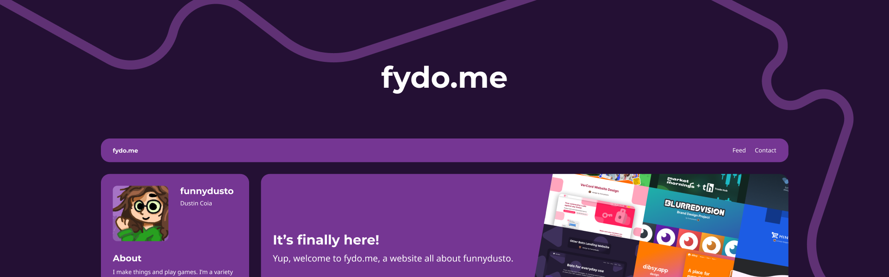

# fydo.me, a webite all about funnydusto.
An open-sourced, handmade, simple website built for the fydo.me brand.

***

## Features
- Keep up-to-date on news
- Explore portfolios and blogs
- Network and connect better
- Order with confidence

## Frequently Asked Questions
1. May I use this for my website?
 - Yes, as long as you give credit to funnydusto and fydo.me's github page.
2. How can I use this?
 - You can change things in their respective locations, you'll see notes and comment strips everywhere to help guide you.

## Support development
Your contribution over on Patreon helps support the development of ChibeeU, fydo.me, and more services that are brought to you by funnydusto. Become a patron for just $3/month [now](https://patreon.com/funnydusto "Support funnydusto on Patreon").

Wanna talk code, art, design, or stay in the know about everything funnydusto? Join the [Discord server](https://discord.gg/A3wQWfKVyk "Join dustin's lounge")!
